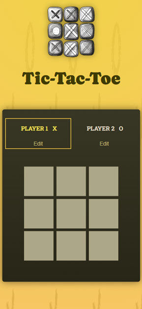

# Tic Tac Toe

A classic Tic Tac Toe game built with React + Vite.
Play locally with two players, edit names, and track each move.

## 🚀 Features

⚛️ `Built with React (Vite)` – fast and modern frontend setup

👥 `Two Players` – play locally with editable player names

🧩 `Game Board Preview` – live updates of each move on the grid

📱 `Responsive Design` – works smoothly on desktop and mobile

🔁 `Restart Option` – instantly start a new round after game over

🧾 `Move Log` – shows the history of played moves below the board

🎯 `Active Player Indicator` – highlights whose turn it is

🧠 `State Management` – implemented with React useState hooks for dynamic UI updates

🧑‍💻 `Tech Stack`:

- React 19

- Vite

- JavaScript (ES6+)

- CSS / Responsive Layout

## 🖼️ Preview

## 🕹️ How to Play

1) Enter or edit player names (click “Edit” → type → “Save”).

2) Player X starts first.

3) Click on a square to place your mark.

4) The game announces the winner or a draw.

5) Click “Rematch” to restart and play again.

## 💾 Installation & Setup
### 1. Clone the repository
git clone https://github.com/your-username/react-tic-tac-toe.git

### 2. Navigate into the project folder
cd react-tic-tac-toe

### 3. Install dependencies
npm install

### 4. Start the development server
npm run dev

Then open your browser and visit: http://localhost:5173/

## 🧩 Possible Improvements

[ ] Add score tracking across rounds

[ ] Add single-player mode with a simple AI opponent

[ ] Include animations for moves and transitions

## ⚖️ License

This project is open-source and available under the `MIT License`.

